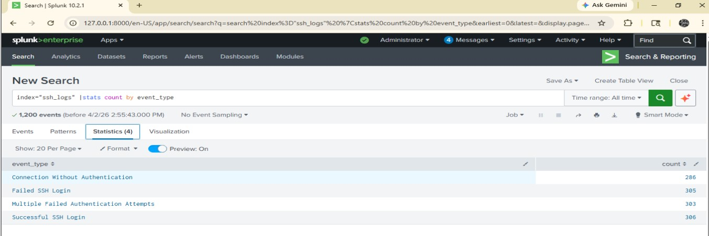
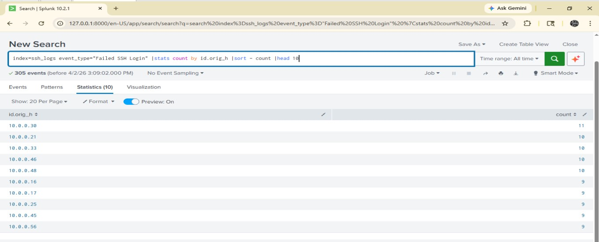
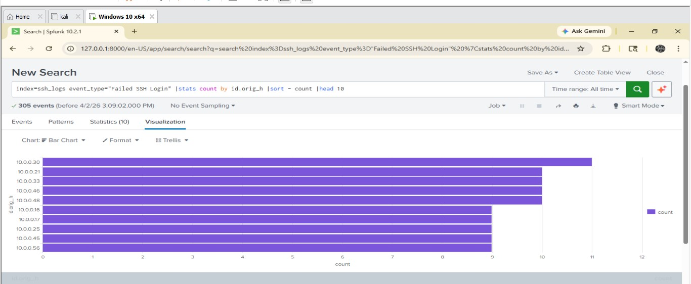
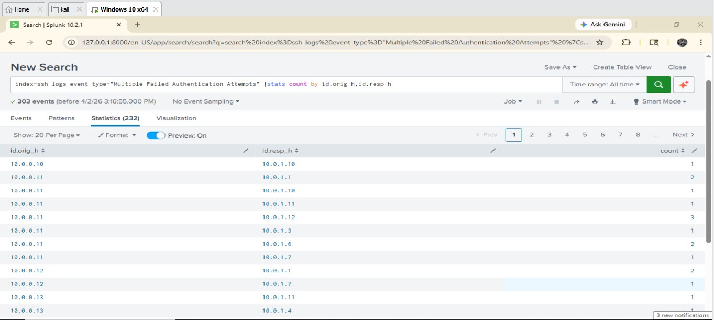
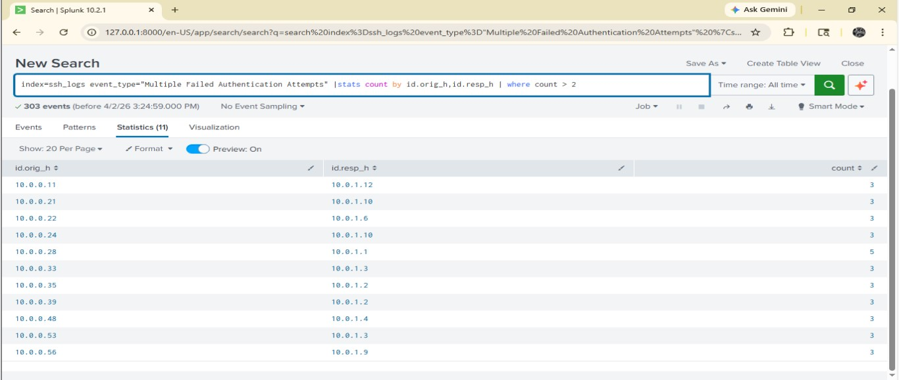
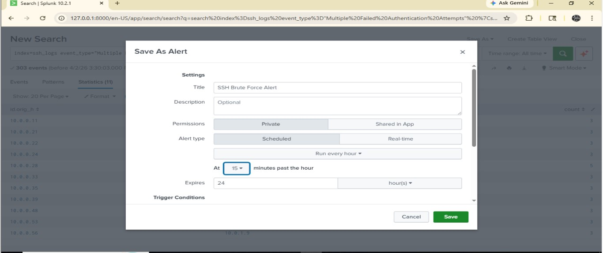
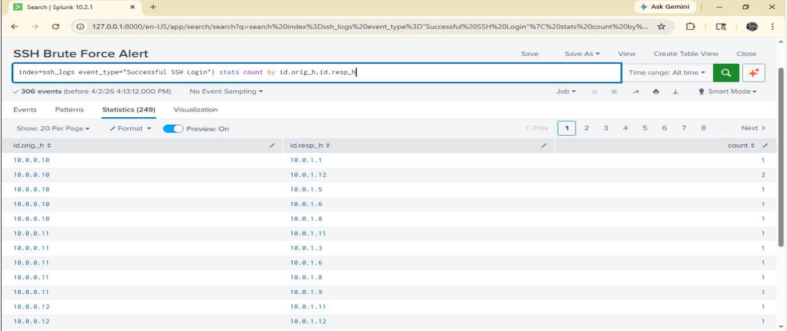
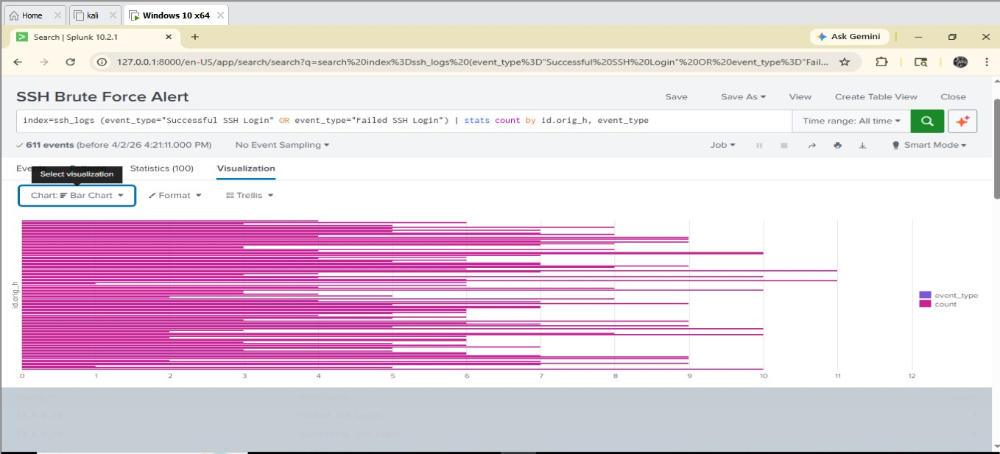
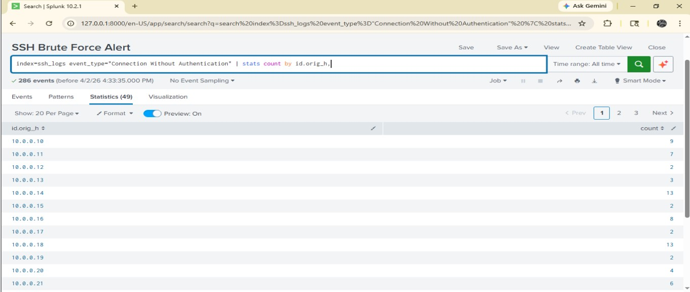
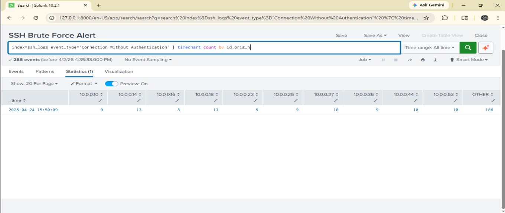

# 🔐 SSH Log Analysis using Splunk (SOC Project)

## 📌 Overview

This project demonstrates real-world SSH log analysis using Splunk SIEM to detect brute-force attacks, failed logins, successful logins, and suspicious connections.

---

## 🎯 Objectives

* Detect failed SSH login attempts
* Identify brute-force attacks
* Track successful logins
* Detect suspicious unauthenticated connections

---

## 🛠️ Lab Setup

* Splunk Enterprise
* Windows VM
* SSH Logs (JSON)
* Kali Linux (optional)

---

## ⚙️ Data Ingestion

Logs were uploaded and verified in Splunk.

📸


---

## 🔍 Task 1: Log Parsing

**Query:**

```
index=ssh_logs | stats count by event_type
```

📸


---

## 🔍 Task 2: Failed Login Detection

**Query:**

```
index=ssh_logs event_type="Failed SSH Login"
| stats count by id.orig_h | sort -count | head 10
```

📸 Top attacking IPs:


📸 Visualization:


---

## 🔍 Task 3: Brute Force Detection

**Query:**

```
index=ssh_logs event_type="Multiple Failed Authentication Attempts"
| stats count by id.orig_h, id.resp_h
```

📸 Raw data:


📸 Filtered suspicious attempts:


📸 Alert configuration:


---

## 🔍 Task 4: Successful Login Tracking

**Query:**

```
index=ssh_logs event_type="Successful ssh login"
| stats count by id.orig_h, id.resp_h
```

📸 Successful logins:


---

## 🔍 Task 5: Login Correlation (Very Important)

Correlated failed + successful logins.

**Query:**

```
index=ssh_logs (event_type="Successful SSH Login" OR event_type="Failed SSH Login")
| stats count by id.orig_h, event_type
```

📸 Correlation table:


📸 Visualization:


---

## 🔍 Task 6: Suspicious Connections

**Query:**

```
index=ssh_logs event_type="Connection Without Authentication"
| stats count by id.orig_h
```

📸 Stats:


📸 Time-based detection:


---

## 📊 Key Outcomes

* Detected brute-force attack patterns
* Identified attacker IPs
* Correlated failed and successful logins
* Built alerting mechanism in Splunk
* Detected reconnaissance activity

---

## 🧠 MITRE ATT&CK Mapping

* T1110 – Brute Force

---

## 🚀 Skills Demonstrated

* Splunk SIEM
* Log analysis & threat detection
* SPL query writing
* Alert creation
* Data visualization

---

## 👨‍💻 Author

Surya
Aspiring SOC Analyst / VAPT Enthusiast

---

## ⭐ Support

If you found this useful, give this repo a star ⭐

